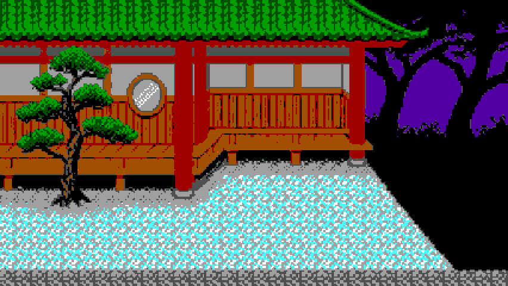

# The Unread Fan

A Heian-era parser adventure in the courtyard of the capital. Walk with the arrow keys. Type what the prince should do. The case stays in this browser.



The fan in the hall is a letter. An ofuda on the gravel is a record of something that crossed the yard. People in the capital will greet you, and they will talk about what they know. Solving the case and leaving it alone are different endings.

## Play

Serve the folder as static files and open `index.html`. Nothing in the game calls a backend. The first visit downloads the open-jev model (`kev-0.6b`) into the browser and shows the download on the title screen. Later visits use that cache.

```bash
python3 -m http.server 8765
```

Then open [http://localhost:8765/index.html](http://localhost:8765/index.html).

**Start game** begins a new case. **Continue game** appears when one is already saved. **Reset game** clears that save and returns you to the courtyard without downloading the interpreter again.

Arrow keys move. Walking off an open side of a scene changes rooms on the same page. The minimap fills in as you enter places, and the arrows under it show which ways leave the room you are in. Refreshing shows the title again. Continue puts you back in the room you left, with your score and the message log.

The save is the `heian-case-v1` entry in local storage.
